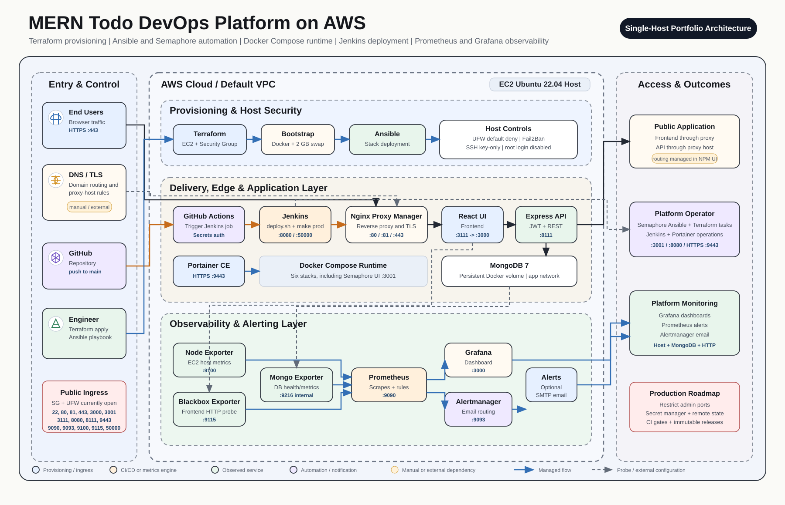
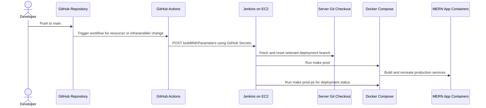

# MERN Todo DevOps Platform on AWS

An end-to-end DevOps implementation for deploying and observing a containerized MERN task-management application on AWS. The project provisions an EC2 host with Terraform, configures and secures it with Ansible, deploys application and platform services through Docker Compose, triggers deployments through GitHub Actions and Jenkins, and monitors availability and infrastructure health with Prometheus and Grafana.

## Project At A Glance

| Area | Implementation |
| --- | --- |
| Application | React frontend, Express REST API, MongoDB persistence, JWT authentication and email password-reset flow |
| Cloud platform | AWS EC2 running Ubuntu 22.04 in the default VPC |
| Infrastructure as code | Terraform AWS provider and EC2/security group resources |
| Server automation | Ansible playbook with Docker installation, host hardening and stack deployments |
| Runtime platform | Docker Engine and Docker Compose |
| Ingress | Nginx Proxy Manager for intended HTTP/HTTPS proxying and certificate management |
| Delivery pipeline | GitHub Actions trigger to Jenkins pipeline, deployed on the EC2 host |
| Observability | Prometheus, Grafana, Alertmanager, Node Exporter, Blackbox Exporter and MongoDB Exporter |
| Security controls | SSH key-only login, root SSH login disabled, UFW default deny policy and Fail2Ban |

## Architecture



The diagram follows the layered presentation style of a production platform design while remaining aligned with this repository's implemented configuration:

- The runtime is a **single-host architecture**: application, Jenkins, proxy and monitoring containers run on one EC2 instance.
- Terraform creates the EC2 instance and security group; Ansible installs/configures host software and deploys each Compose stack.
- GitHub Actions does not build the application itself. It authenticates to Jenkins and triggers a deployment job.
- Jenkins updates the server-side repository checkout and invokes the production Docker Compose workflow through `make prod`.
- Nginx Proxy Manager is deployed in code, but proxy-host routes, DNS records and TLS certificate setup are operational/manual configuration outside Terraform and Ansible.
- The observability stack monitors EC2 host health, MongoDB health and frontend HTTP availability.

## Business And Application Goal

The platform hosts a MERN Todo application that demonstrates a realistic web workload for infrastructure automation:

- User registration and login with JWT-based authenticated API requests.
- Task creation, listing, completion-state views and deletion.
- MongoDB-backed application persistence.
- Email-assisted password reset workflow.
- Separate local development and server production container configurations.

Application source code is stored under [`./resource/`](./resource/), with runtime usage documented in [`./resource/README.md`](./resource/README.md).

## Technology Stack

| Domain | Technologies |
| --- | --- |
| Cloud and provisioning | AWS EC2, AWS Security Group, Terraform, HashiCorp AWS Provider |
| Configuration management | Ansible, Jinja2 templates, Ubuntu, UFW, Fail2Ban, OpenSSH |
| Application | MongoDB 7, Express.js, React, Node.js, Mongoose, JWT, bcrypt, Nodemailer |
| Containers | Docker Engine, Docker Compose, Docker volumes and bridge networks |
| Reverse proxy | Nginx Proxy Manager |
| CI/CD | GitHub Actions, Jenkins Pipeline, Groovy initialization and Make |
| Metrics and alerting | Prometheus, Grafana, Alertmanager, Node Exporter, Blackbox Exporter and Percona MongoDB Exporter |

## Repository Structure

```text
README.md                               # Project and infrastructure documentation
final-project-architecture.svg          # Repository-native architecture diagram
infra/
├── terraform/
│   ├── data.tf                         # Ubuntu AMI lookup
│   ├── ec2.tf                          # EC2 host definition
│   ├── security_group.tf               # Inbound/outbound security group rules
│   ├── provider.tf                     # AWS provider configuration
│   ├── variables.tf                    # Terraform input variables
│   ├── outputs.tf                      # EC2 ID, IP, DNS and AMI outputs
│   └── scripts/bootstrap.sh            # Initial Docker and swap bootstrap
└── ansible/
    ├── install_vps.yml                 # Top-level server setup playbook
    ├── hosts.ini.example               # Static inventory example
    ├── templates/                      # App, monitoring and alert configuration templates
    ├── tasks/                          # Docker, hardening, app, proxy, CI/CD and monitoring tasks
    └── files/
        ├── ci-cd/                      # Jenkins image, pipeline and deploy script
        ├── monitoring/                 # Prometheus, Grafana and Alertmanager stack
        └── nginx-proxy-manager/        # Edge proxy Compose definition
```

## Infrastructure Provisioning With Terraform

Terraform targets AWS region `us-east-1` by default and provisions a single compute host for the entire platform.

| Terraform definition | Purpose |
| --- | --- |
| `data.aws_ami.ubuntu` | Selects the most recent Canonical Ubuntu Jammy 22.04 AMD64 server image |
| `aws_instance.web` | Creates the EC2 server using the selected AMI and supplied SSH key pair |
| `root_block_device` | Assigns a 20 GB `gp3` root volume |
| `aws_security_group.ec2_sg` | Allows service ports required by the current portfolio deployment |
| `user_data` bootstrap | Creates 2 GB swap and installs Docker Engine and Compose plugin |

### Infrastructure Boundary

The current Terraform implementation does **not** provision a custom VPC, subnet topology, Elastic IP, Route 53 DNS, ACM certificate, application load balancer, managed database, IAM application role or remote Terraform backend. The security group is therefore attached in the default VPC, and DNS/TLS routing is managed separately from this codebase.

## Server Configuration With Ansible

[`infra/ansible/install_vps.yml`](./infra/ansible/install_vps.yml) configures the EC2 instance in a defined order:

| Sequence | Imported task | Outcome |
| ---: | --- | --- |
| 1 | `tasks/docker.yml` | Installs Docker CE, Buildx and Docker Compose v2 |
| 2 | `tasks/swap.yml` | Ensures a 2 GB swap file exists |
| 3 | `tasks/firewall.yml` | Enables UFW with deny-by-default inbound filtering and declared allowed ports |
| 4 | `tasks/fail2ban.yml` | Enables SSH brute-force banning |
| 5 | `tasks/ssh_hardening.yml` | Disables root login and SSH password authentication |
| 6 | `tasks/source_code.yml` | Clones or updates the application repository on the server |
| 7 | `tasks/app.yml` | Generates application environment configuration and starts the production app stack |
| 8 | `tasks/nginx_proxy_manager.yml` | Deploys the HTTP/HTTPS proxy stack |
| 9 | `tasks/ci_cd.yml` | Deploys Jenkins and creates its pipeline job configuration |
| 10 | `tasks/monitoring.yml` | Deploys metrics, dashboards and alerting services |
| 11 | `tasks/verify.yml` | Reports installed Docker versions and running stack state |

The project uses task imports rather than Ansible roles. Environment files rendered to the target host are restricted to mode `0600`, and templating operations containing credentials use `no_log: true`.

## Docker Runtime Architecture

Four Docker Compose concerns are deployed on the EC2 host:

| Stack | Configuration | Containers | Persistent storage |
| --- | --- | --- | --- |
| Production app | [`./resource/docker-compose.prod.yml`](./resource/docker-compose.prod.yml) | `mongodb`, `backend`, `frontend` | MongoDB named volume |
| Reverse proxy | [`infra/ansible/files/nginx-proxy-manager/docker-compose.nginx-proxy-manager.yml`](./infra/ansible/files/nginx-proxy-manager/docker-compose.nginx-proxy-manager.yml) | Nginx Proxy Manager | Local data and Let's Encrypt directories |
| CI/CD | [`infra/ansible/files/ci-cd/docker-compose.ci-cd.yml`](./infra/ansible/files/ci-cd/docker-compose.ci-cd.yml) | Jenkins | Jenkins home bind mount |
| Monitoring | [`infra/ansible/files/monitoring/docker-compose.monitoring.yml`](./infra/ansible/files/monitoring/docker-compose.monitoring.yml) | Grafana, Prometheus, Node Exporter, Blackbox Exporter, MongoDB Exporter, Alertmanager | Grafana, Prometheus and Alertmanager named volumes |

### Application Containers

| Container | Function | Current host mapping |
| --- | --- | --- |
| `mern-todo-frontend-prod` | React production bundle served using `serve` | `3111 -> 3000` |
| `mern-todo-backend-prod` | Express REST API and JWT authentication | `8111 -> 8111` |
| `mern-todo-mongodb` | MongoDB persistence layer | `27017 -> 27017` in Compose |

The frontend production Dockerfile uses a multi-stage build, and both production Node application images run under non-root users.

## CI/CD Delivery Flow

The deployment flow is implemented across GitHub Actions, Jenkins and the EC2 Docker runtime:



### Pipeline Components

| File | Function |
| --- | --- |
| [`.github/workflows/trigger-jenkins-deploy.yml`](./.github/workflows/trigger-jenkins-deploy.yml) | Triggers Jenkins on relevant `main` branch changes or manual dispatch |
| [`infra/ansible/tasks/ci_cd.yml`](./infra/ansible/tasks/ci_cd.yml) | Creates Jenkins configuration and managed deployment job |
| [`infra/ansible/files/ci-cd/Dockerfile.jenkins`](./infra/ansible/files/ci-cd/Dockerfile.jenkins) | Builds Jenkins with Docker CLI, Git, Make and Pipeline plugins |
| [`infra/ansible/files/ci-cd/jobs/deploy-mern-todo/Jenkinsfile`](./infra/ansible/files/ci-cd/jobs/deploy-mern-todo/Jenkinsfile) | Defines the deploy stage and prevents concurrent deployment builds |
| [`infra/ansible/files/ci-cd/scripts/deploy.sh`](./infra/ansible/files/ci-cd/scripts/deploy.sh) | Updates source checkout and rebuilds/restarts the production application stack |

Currently the deployment script deploys the selected branch head. Although GitHub Actions submits a commit SHA, Jenkins does not yet pin the deployment to that immutable revision.

## Observability And Alerting

The monitoring stack is preconfigured through versioned files and joins the production application Docker network where required.

| Service | Role | Data collected or action |
| --- | --- | --- |
| Prometheus | Time-series collection and rule evaluation | Scrapes exporters and runs alert rules every 15 seconds |
| Grafana | Visualization | Automatically provisioned Prometheus datasource and project dashboard |
| Node Exporter | EC2 host monitoring | CPU, memory, root disk and network throughput |
| Blackbox Exporter | Synthetic availability checks | HTTP `2xx` probe for the frontend container |
| MongoDB Exporter | Database monitoring | MongoDB reachability and database operating metrics |
| Alertmanager | Notification routing | Optional SMTP email notifications when configured |

Configured alert rules include:

- Node Exporter unavailable.
- CPU usage above 85 percent for five minutes.
- Memory usage above 90 percent for five minutes.
- Root disk usage above 85 percent for five minutes.
- MongoDB Exporter unavailable or unable to connect to MongoDB.
- Frontend HTTP health probe failure.

Monitoring configuration and operational checks are documented in [`infra/ansible/files/monitoring/README.md`](./infra/ansible/files/monitoring/README.md).

## Networking And Published Ports

The AWS security group and UFW rules currently permit the following host access:

| Port | Service | Reason for exposure in current setup | Recommended production posture |
| ---: | --- | --- | --- |
| `22` | SSH | Server administration and Ansible connection | Restrict to trusted CIDR/VPN/bastion |
| `80`, `443` | Nginx Proxy Manager | Public application web ingress | Public exposure expected |
| `81` | Nginx Proxy Manager admin UI | Proxy administration | Restrict to operator network |
| `3000` | Grafana | Dashboard access | Restrict or proxy with authentication |
| `3111` | React frontend direct port | Direct app access | Route only through proxy |
| `8080` | Jenkins UI | Delivery administration and GitHub trigger endpoint | Restrict and proxy securely |
| `8111` | Express API direct port | API access | Route only through proxy |
| `9090` | Prometheus | Metrics query UI | Private access only |
| `9093` | Alertmanager | Alert administration UI | Private access only |
| `9100` | Node Exporter | Host metrics | Internal scraping only |
| `9115` | Blackbox Exporter | Probe endpoint | Internal scraping only |
| `50000` | Jenkins agent channel | Jenkins inbound agents | Remove unless specifically needed |

MongoDB is bound to host port `27017` by the production Compose definition, although no corresponding AWS security group or UFW allow rule is declared. In a hardened version, MongoDB should not publish a host port because the backend and exporter reach it through Docker networks.

## Configuration And Secrets

Configuration currently moves through several mechanisms:

| Configuration type | Mechanism |
| --- | --- |
| AWS provisioning inputs | Terraform variables and local secret tfvars file |
| Application runtime configuration | Ansible-rendered application `.env` file |
| Jenkins bootstrap configuration | Ansible-created `.env` file and Groovy initialization |
| Grafana and exporter credentials | Ansible-rendered monitoring `.env` file |
| Alert SMTP password | Environment variable or ignored local password file |
| GitHub-to-Jenkins authentication | GitHub Actions encrypted secrets |

Before using this project outside a private learning environment, replace placeholder/default passwords and secrets with externally managed values. A stronger design would use AWS Systems Manager Parameter Store or AWS Secrets Manager for runtime secrets, an IAM role or OIDC credentials for Terraform automation, and Ansible Vault or a secrets backend for deployment configuration.

## Deployment Guide

### 1. Provision The EC2 Host

From `infra/terraform`, configure non-placeholder variables securely and provision the host:

```sh
cd infra/terraform
terraform init
terraform plan -var-file="terraform.tfvars" -var-file="secrets.tfvars"
terraform apply -var-file="terraform.tfvars" -var-file="secrets.tfvars"
```

Terraform returns the public IP and DNS name used for the Ansible inventory.

### 2. Configure The Inventory

Copy the provided inventory template and supply the EC2 host address and SSH key reference:

```sh
cd ../ansible
cp hosts.ini.example hosts.ini
```

### 3. Supply Deployment Secrets

At minimum, override administrator credentials and notification credentials rather than using repository defaults:

```sh
export JENKINS_ADMIN_ID="admin"
export JENKINS_ADMIN_PASSWORD="<strong-password>"
export GRAFANA_ADMIN_USER="admin"
export GRAFANA_ADMIN_PASSWORD="<strong-password>"
export ALERTMANAGER_SMTP_PASSWORD="<smtp-app-password>"
```

Application database and JWT credentials should likewise be moved out of checked-in defaults before any public deployment.

### 4. Configure The Host And Deploy Stacks

```sh
ansible-playbook -i hosts.ini install_vps.yml
```

### 5. Configure External Routing

After Nginx Proxy Manager is deployed, create proxy hosts and certificates for the frontend and API endpoints. DNS and proxy host definitions are not currently provisioned in this repository.

### 6. Verify Operations

- Confirm the public application is accessible through HTTPS.
- Confirm Jenkins has the managed `deploy-mern-todo` pipeline job.
- Confirm Prometheus targets are healthy.
- Confirm Grafana loads the provisioned dashboard.
- Confirm Alertmanager notifications work if SMTP settings were provided.

## DevOps Practices Demonstrated

- Infrastructure provisioning codified with Terraform.
- Host configuration and platform service deployment automated using Ansible.
- Application runtime isolation with Docker Compose and persistent storage volumes.
- Server security baseline using UFW, Fail2Ban and hardened SSH.
- CI/CD integration linking GitHub changes to Jenkins deployments.
- Dashboard and alert provisioning stored as code.
- Production application images configured to run as non-root users.
- Sensitive generated files restricted with filesystem permissions and Ansible log suppression.

## Production Hardening Roadmap

This repository is appropriate as a learning and portfolio deployment, but the following work should be completed before representing it as production-ready:

| Priority | Improvement |
| --- | --- |
| Critical | Remove default credentials and JWT values from committed configuration; use a managed secret workflow |
| Critical | Close public administration/metrics ports and expose public traffic only through HTTPS ingress |
| Critical | Address application security issues such as password hash exposure, reset-token handling and authorization checks on task deletion |
| High | Deploy an immutable commit SHA or container image tag rather than resetting to a moving branch |
| High | Add CI gates for application tests, linting, Terraform validation, Ansible validation and image/dependency scanning |
| High | Move Terraform state to an encrypted remote backend with locking and commit the provider lock file |
| High | Reduce Jenkins privilege and limit access to the host Docker socket |
| Medium | Provision or document DNS, TLS and Nginx Proxy Manager host routing consistently |
| Medium | Remove unnecessary host port bindings, particularly MongoDB and internal monitoring endpoints |
| Medium | Pin container image versions/digests and improve reproducible dependency installation |

## Key Documentation References

| Topic | Location |
| --- | --- |
| Application container commands | [`./resource/README.md`](./resource/README.md) |
| Terraform configuration | [`./infra/terraform/`](./infra/terraform/) |
| Ansible orchestration | [`./infra/ansible/install_vps.yml`](./infra/ansible/install_vps.yml) |
| Jenkins deployment pipeline | [`./infra/ansible/files/ci-cd/jobs/deploy-mern-todo/Jenkinsfile`](./infra/ansible/files/ci-cd/jobs/deploy-mern-todo/Jenkinsfile) |
| Monitoring operations | [`./infra/ansible/files/monitoring/README.md`](./infra/ansible/files/monitoring/README.md) |
| Architecture image | [`./final-project-architecture.svg`](./final-project-architecture.svg) |
